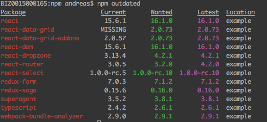

---
@title[Frontpage]
## Scalaバックエンドシステムのフロント選択: ScalaJS or Typescript？

#### Andreas Alexelis
#### Bizreach Co. Ltd., 2017-11-10
---
@title[About the presenter]
## About the presenter

- Name: Andreas Alexelis
- Nationality: Greece
- Age: 45 :scream:
- First computer was a [TI-994A](http://oldcomputers.net/ti994a.html)
- Learned Pascal at University
- Wrote in C,C++ for Master Thesis
- Suffered enterprise Java at a big Japanese maker company
- Had several nervous breakdowns from Javascript when free-lancing
- Happily writing Scala/... at Stanby, Bizreach currently.
---
@title[Introduction]
## Introduction
Let's get to know each other!
- What kind of team do you work in (BE engineers, FE engineers, designers)
- What backend technologies do you use?
- What frontend technologies do you use?
- Are you happy with the level of integration?
---
@title[Problems]
## The problem
How do we know we have a problem?
- Data structures have to be declared and maintained separately
- There is similar code back and front
- things break silently _(js :scream:)_ when sync is lost
---
@title[Problems: Duplicate data models]
### Data structures have to be declared and maintained separately

TODO: put gist of a data structure in back and front
+++?code=jvm/app/utils/Validator.scala&lang=Scala&title=CatalogBackend
+++?code=/npm/ts/examples/typescript/Countries.ts&lang=Typescript&title=CatalogFronten

##### What will happen if I add a country only in frontend? _Note to Self: Make common!_
---
@title[Problems: Duplicate code]
### There is similar code back and front

+++?code=jvm/app/utils/Validator.scala&lang=Scala
+++?code=/npm/ts/examples/typescript/FormValidator.ts&lang=Typescript

##### They look so alike!　_Note to Self: DRY!_
---
@title[Problems: Silent errors]
### Things break silently when sync is lost

---
@title[More problems]
## More problems
- Frontend version management is tedious
- Complicated business logic in frontend
- Skillset of dev-team
- Security
---
@title[More problems: Frontend version management]
## Frontend version management is tedious

---
@title[More problems: Logic in the view]
## Complicated business logic in frontend
---
@title[More problems: Team skillset]
## Skillset of dev-team
---
@title[More problems: Security]
## Security
---
@title[Basics: Architecture]
## Architecture
- The MVC paradigm
- The MVVM paradigm
- A typical modern system paradigm
---
@title[Basics: Team]
## Team

### Members
- Back-end developers
- Front-end developers
- Designers

### Issues to think about:
- What language do they speak?
- What libraries do they use?
---
@title[Evolution of Web Apps]
## Evolution of Web applications
- Plain HTML -> Form example with back-end validation
  None of the problems but really lame
- HTML + js file -> Form example
  Breaks immediately when not maintained properly (give example)
- Server rendered HTML + embedded js -> Hand made or Lift form example
  Solves one part of maintenance problem, but js is kept embedded within host language, which has it's own problems
- Other??
- API backend + Typescript Frontend
- Integrated Scala backend + ScalaJS frontend
---
@Title[Typescript]
## Typescript
- what it is
- what it does
- which part of the problem does it solve
- what are it's shortcomings
TODO: references from Typescript website
- https://www.typescriptlang.org/
- how to install it for Scala applications
- how to streamline compiling
---
@Title[ScalaJs]
## ScalaJS
- what it is
- what it does
- which part of the problem does it solve
- what are it's shortcomings: eco-system, designer difficulty
TODO: references from ScalaJs website
- https://www.scala-js.org/
- the screen that shows the comparison
- how to setup in SBT scala applications
---
Angular
- TODO: Should use directly from myjlpt?
---
React
- TODO: Can I find some quick samples for ScalaJS/Play ?
